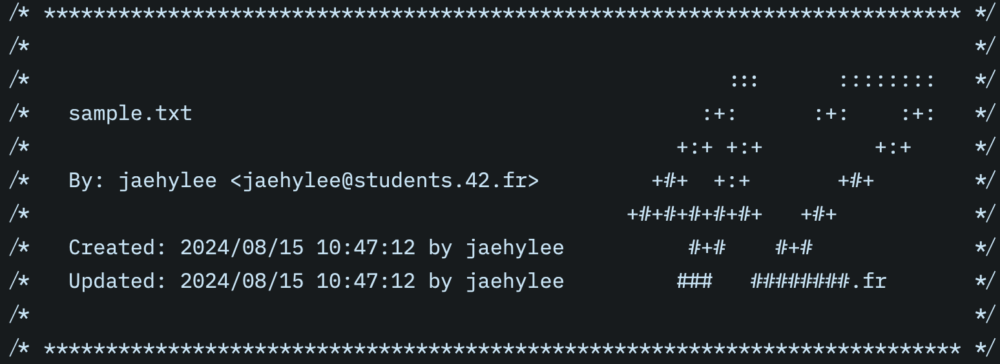

# inject_42h

This is a simple cli which prepends 42 header (from 42 school) to your desired file.
Required arguments are as follows:

- name: your 42 identifier
- email: your 42 email
- path: path to your desired file

Generated output is like this:



This program is designed to work with [norminette LSP](https://github.com/DavidLee18/norminette_lsp) for Zed.
This means if you do some config, then when you save file, [Norminette extension](https://github.com/DavidLee18/zed_norminette) will **automatically update your 42 header.**
you have to do:
1. download executable from release page.
2. install "Norminette" extension in Zed.
3. in your Zed's `settings.json`, create or add like following, to the `"lsp"`:
```json
"lsp": {
    ...
		"c-norminette": {
			"initialization_options": {
				"path": "/path/to/inject_42h",
				"name": "<42 Intra ID>",
				"email": "<42 Intra Email>",
				"offset": 9 // timezone offset to UTC. positive for +, negative for -
			}
		},
    ...
	}
```
4. **enjoy!**

the extension will download and execute the LSP for Norminette, and when you save the file, the 42 header will be created or updated automatically!
